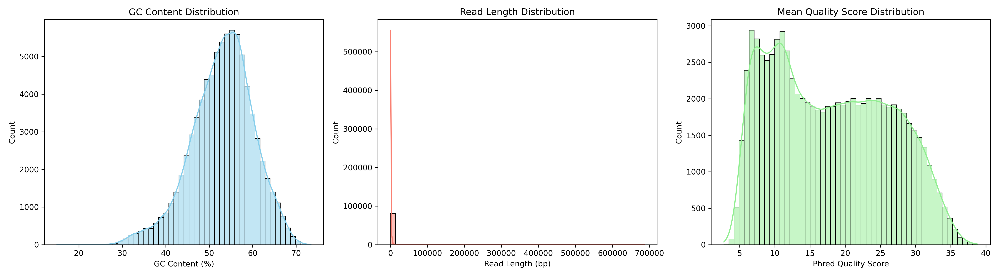

# mini-bioinformatics-pipeline
This project is an automated Snakemake workflow that extracts and visualizes quality control metrics from long-read sequencing data (fastq).


### Analysis Results Summary

#### 1. Read Quality and Length Distribution

[Read Quality and Length Distribution](results/nanoplot/LengthvsQualityScatterPlot_kde.html)

#### 2. Comprehensive Metrics (Custom Analysis)



#### 3. Key Statistics
For a more detailed and interactive analysis, you can download the full [NanoPlot HTML Report](./results/nanoplot/NanoPlot-report.html).

# Installation
After cloning the project, to create the Conda environment containing the necessary dependencies:

```bash
conda env create -f environment.yml
conda activate longread_env
